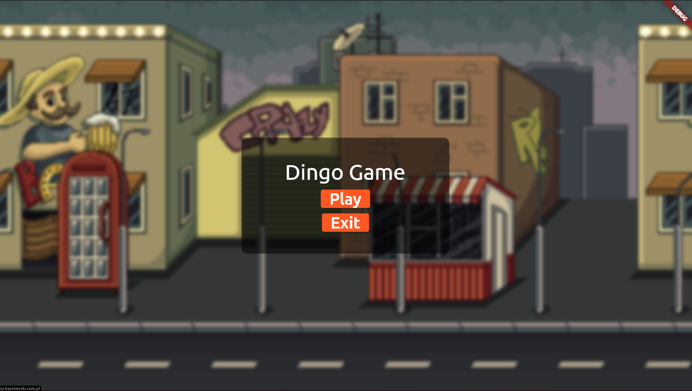
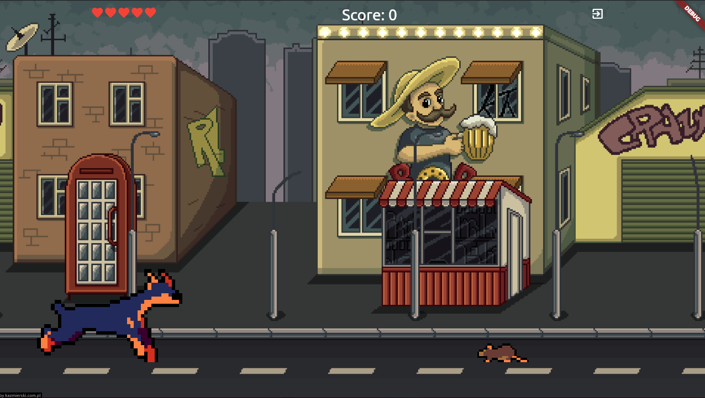
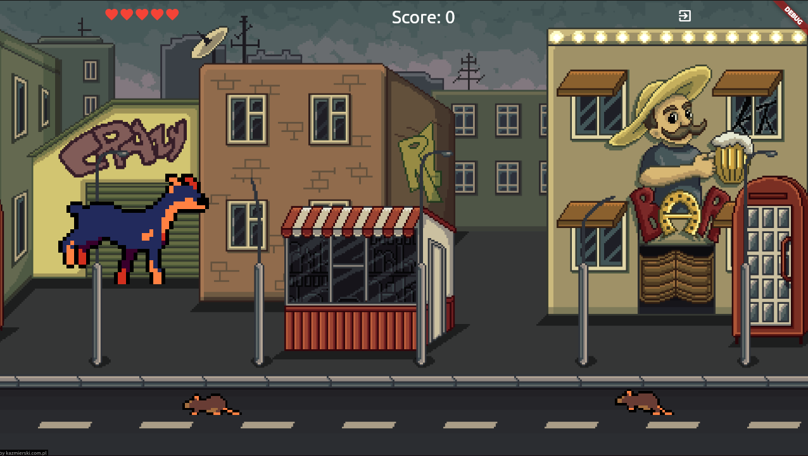
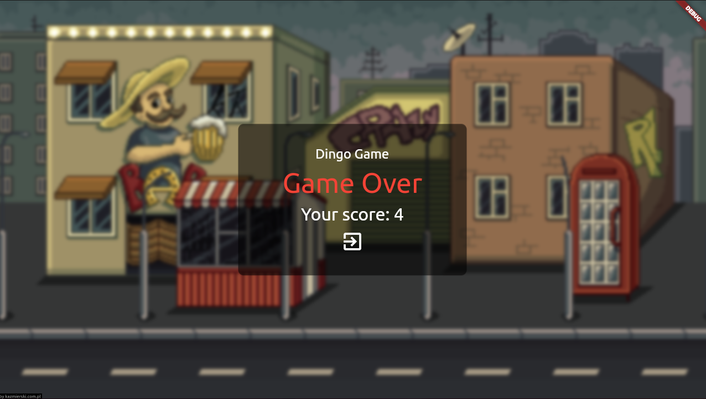

# dingo

Flutter game: Dingo

## Info

- Flutter game engine: Flame: https://docs.flame-engine.org/
- free sprites and backgrounds: https://craftpix.net/
- Flutter BLoC - a predictable state management library for Dart: https://bloclibrary.dev/#/

## Screenshots:

## Release

- appbundle: flutter build appbundle --release
- build APK: flutter build apk --release >> build\app\outputs\flutter-apk\app-release.apk
- linux: flutter build linux --release >> build/linux/release/bundle
